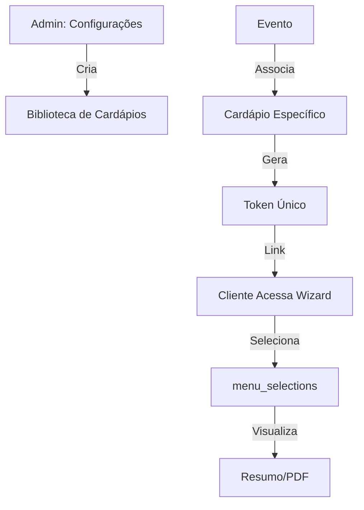

# 🍽️ Feature: Sistema de Cardápios para Eventos

**Status:** Planning
**Prioridade:** Alta
**Estimativa:** 2-3 semanas
**Integração:** METRI Event Management System

---

## 📋 Resumo Executivo

Adicionar funcionalidade de cardápios ao sistema METRI, permitindo que organizadores criem bibliotecas de cardápios e compartilhem com clientes através de links únicos por evento, onde podem selecionar itens de forma livre e não-linear.

**Princípio chave:** KISS - Integração simples e direta ao sistema existente, sem over-engineering.

---

## 🎯 Problema & Solução

### Problema
Organizadores de eventos precisam:
- Apresentar opções de cardápio aos clientes
- Receber seleções de forma organizada
- Manter biblioteca de cardápios reutilizáveis
- Compartilhar de forma profissional (não WhatsApp/email)

### Solução
Sistema integrado ao METRI com:
1. **Admin:** Biblioteca de cardápios em Configurações
2. **Wizard:** Link compartilhável por evento para seleção do cliente
3. **Mobile-first:** Otimizado para tablet/celular

---

## 👥 User Stories

### Epic 1: Gerenciamento de Cardápios (Admin)

**US-1.1: Criar Cardápio**
```
Como organizador
Quero criar um cardápio reutilizável
Para usar em múltiplos eventos
```
**Critérios:**
- ✅ Nome, descrição, status (Ativo/Inativo)
- ✅ Categorias com nome e "Recomendado: N" (opcional)
- ✅ Itens com imagem, nome, descrição, tags
- ✅ Ordenação drag-and-drop
- ✅ Pré-visualização mobile/tablet

**US-1.2: Biblioteca de Cardápios**
```
Como organizador
Quero visualizar todos os cardápios
Para reutilizar e gerenciar
```
**Critérios:**
- ✅ Grid de cards com nome, status, ações
- ✅ Ações: Editar, Duplicar, Arquivar
- ✅ Filtro por status

### Epic 2: Seleção de Cardápio (Cliente)

**US-2.1: Acessar Wizard**
```
Como cliente
Quero acessar via link único
Para ver opções do meu evento
```
**Critérios:**
- ✅ URL única por evento: `/eventos/{id}/cardapio/{token}`
- ✅ Sem necessidade de login
- ✅ Título do evento visível
- ✅ Responsivo mobile/tablet

**US-2.2: Selecionar Itens Livremente**
```
Como cliente
Quero navegar entre categorias
Para escolher sem limitações
```
**Critérios:**
- ✅ Navegação não-linear (stepper clicável)
- ✅ Sem limites obrigatórios
- ✅ Indicador "Recomendado: N" (visual apenas)
- ✅ Resumo sempre visível (bottom sheet mobile, sticky tablet)

**US-2.3: Finalizar Seleção**
```
Como cliente
Quero ver resumo das escolhas
Para confirmar e compartilhar
```
**Critérios:**
- ✅ Agrupamento por categoria
- ✅ Contador "Selecionados X • Recomendado N"
- ✅ Campo de observações
- ✅ Exportar PDF / Copiar link

---

## 🏗️ Arquitetura Técnica

### Database Schema (Supabase)

```sql
-- Nova tabela: menus (cardápios)
CREATE TABLE menus (
  id UUID PRIMARY KEY DEFAULT gen_random_uuid(),
  name TEXT NOT NULL,
  description TEXT,
  status TEXT DEFAULT 'active', -- active, inactive, archived
  branding JSONB, -- { color, icon }
  created_at TIMESTAMPTZ DEFAULT NOW(),
  updated_at TIMESTAMPTZ DEFAULT NOW()
);

-- Nova tabela: menu_categories
CREATE TABLE menu_categories (
  id UUID PRIMARY KEY DEFAULT gen_random_uuid(),
  menu_id UUID REFERENCES menus(id) ON DELETE CASCADE,
  name TEXT NOT NULL,
  subtitle TEXT,
  recommended_count INTEGER DEFAULT 0,
  order_index INTEGER DEFAULT 0,
  visible BOOLEAN DEFAULT true,
  created_at TIMESTAMPTZ DEFAULT NOW()
);

-- Nova tabela: menu_items
CREATE TABLE menu_items (
  id UUID PRIMARY KEY DEFAULT gen_random_uuid(),
  category_id UUID REFERENCES menu_categories(id) ON DELETE CASCADE,
  name TEXT NOT NULL,
  description TEXT,
  image_url TEXT,
  tags TEXT[], -- ['veg', 'lactose', etc]
  highlighted BOOLEAN DEFAULT false,
  order_index INTEGER DEFAULT 0,
  created_at TIMESTAMPTZ DEFAULT NOW()
);

-- Relação evento-cardápio
CREATE TABLE event_menus (
  id UUID PRIMARY KEY DEFAULT gen_random_uuid(),
  event_id UUID REFERENCES events(id) ON DELETE CASCADE,
  menu_id UUID REFERENCES menus(id),
  share_token TEXT UNIQUE DEFAULT encode(gen_random_bytes(16), 'hex'),
  created_at TIMESTAMPTZ DEFAULT NOW()
);

-- Seleções do cliente
CREATE TABLE menu_selections (
  id UUID PRIMARY KEY DEFAULT gen_random_uuid(),
  event_menu_id UUID REFERENCES event_menus(id) ON DELETE CASCADE,
  item_id UUID REFERENCES menu_items(id),
  notes TEXT,
  created_at TIMESTAMPTZ DEFAULT NOW()
);
```

### Fluxo de Dados



---

## 🎨 Estrutura de Páginas

### 1. Admin: `/configuracoes` (adicionar tab "Cardápios")

**Componentes:**
- `<MenuList />` - Grid de cards
- `<MenuEditor />` - Editor completo
- `<MenuPreview />` - Pré-visualização mobile/tablet

**Layout:**
```
┌─────────────────────────────────┐
│ Configurações                   │
├─────────────────────────────────┤
│ Categorias | Cardápios          │ ← Nova tab
├─────────────────────────────────┤
│ ┌─────┐ ┌─────┐ ┌─────┐        │
│ │Menu │ │Menu │ │Menu │  +Novo │
│ │  1  │ │  2  │ │  3  │        │
│ └─────┘ └─────┘ └─────┘        │
└─────────────────────────────────┘
```

### 2. Wizard: `/eventos/[id]/cardapio/[token]`

**Rota Pública** (sem autenticação)

**Mobile:**
```
┌────────────────────┐
│ Evento: Casamento  │
├────────────────────┤
│ 🍽️ Cardápio Prime  │
├────────────────────┤
│ [Entradas|Pratos]  │ ← Stepper horizontal
├────────────────────┤
│ ┌────────────────┐ │
│ │ [Imagem]       │ │
│ │ Salada Caesar  │ │
│ │ □ Selecionar   │ │
│ └────────────────┘ │
├────────────────────┤
│ [Resumo: 3 itens]  │ ← Bottom sheet
└────────────────────┘
```

**Tablet:**
```
┌─────────────┬───────────────────────┐
│ Categorias  │ Conteúdo              │
│             │                       │
│ • Entradas  │ Grid 2 colunas        │
│ • Pratos    │ ┌─────┐  ┌─────┐     │
│ • Bebidas   │ │Item │  │Item │     │
│ • Sobremesa │ │  1  │  │  2  │     │
│             │ └─────┘  └─────┘     │
│             │                       │
│             ├───────────────────────┤
│             │ Resumo (sticky)       │
│             │ 5 selecionados        │
└─────────────┴───────────────────────┘
```

---

## 🔗 Pontos de Integração

### 1. Menu Configurações
- Adicionar tab "Cardápios" ao lado de "Categorias"
- Reutilizar componentes UI existentes (cards, dialogs)

### 2. Página de Eventos
- Adicionar botão "Cardápio" em cada evento
- Modal para:
  - Selecionar cardápio da biblioteca
  - Gerar/copiar link compartilhável
  - Ver seleções recebidas

### 3. Supabase Services
```typescript
// lib/supabase/menu-services.ts
export const menuService = {
  getAll: () => supabase.from('menus').select('*'),
  create: (data) => supabase.from('menus').insert(data),
  // ... CRUD completo
}
```

---

## 📱 Mobile/Tablet Guidelines

### Breakpoints
- **Mobile:** 360-428px → 1 coluna, bottom sheet
- **Tablet:** 768-1024px → 2 colunas, sticky sidebar

### Gestos
- ✅ Swipe horizontal no stepper
- ✅ Tap-hold para zoom de imagem
- ✅ Swipe-down fecha modais

### Performance
- ✅ Lazy-load imagens
- ✅ Skeleton screens
- ✅ Otimização de imagens (Next.js Image)

---

## 🚀 Fases de Implementação

### Fase 1: Database & API (1 semana)
1. ✅ Criar tabelas Supabase
2. ✅ RLS policies
3. ✅ Services (menu-services.ts)
4. ✅ Hooks (use-menus.ts)

### Fase 2: Admin UI (1 semana)
1. ✅ Tab "Cardápios" em Configurações
2. ✅ MenuList component
3. ✅ MenuEditor component
4. ✅ Integração com eventos

### Fase 3: Wizard Cliente (1 semana)
1. ✅ Rota `/eventos/[id]/cardapio/[token]`
2. ✅ Wizard mobile/tablet
3. ✅ Seleção e resumo
4. ✅ Export PDF

### Fase 4: Polish (opcional)
1. ✅ Biblioteca de imagens
2. ✅ Drag-and-drop avançado
3. ✅ Analytics de seleções

---

## ⚠️ Riscos & Mitigações

| Risco | Impacto | Mitigação |
|-------|---------|-----------|
| Over-engineering | Alto | Seguir KISS, MVP primeiro |
| Performance mobile | Médio | Lazy-load, otimização |
| UX confusa | Alto | Testes com usuários reais |
| Upload de imagens | Médio | Supabase Storage + resize |

---

## 📊 Success Metrics

- ✅ Admin cria cardápio em < 10 min
- ✅ Cliente seleciona itens em < 5 min (mobile)
- ✅ 90%+ seleções completadas
- ✅ Zero bugs críticos em produção

---

## 🎨 Design System (Reutilizar METRI)

**Cores:**
- Primary: `#059669` (verde METRI)
- Secondary: `#10b981`
- Neutros: Cinzas existentes

**Componentes:**
- Reutilizar shadcn/ui components
- Manter identidade visual METRI
- Animações Framer Motion

---

## ✋ O Que NÃO Fazer

- ❌ Landing page separada
- ❌ Sistema de autenticação próprio
- ❌ Limites obrigatórios de seleção
- ❌ Multi-idioma (só PT-BR)
- ❌ Integrações com WhatsApp/email (fase 1)
- ❌ Analytics complexo (fase 1)

---

## 📝 Próximos Passos

1. **Aprovação do PRD** - Review com stakeholder
2. **Database Setup** - Criar migrations
3. **Implementação Fase 1** - Backend primeiro
4. **Testes** - Cada fase independente
5. **Deploy Gradual** - Feature flag opcional

---

**Criado em:** 01/10/2025
**Última atualização:** 01/10/2025
**Autor:** Claude Code + Leandro
